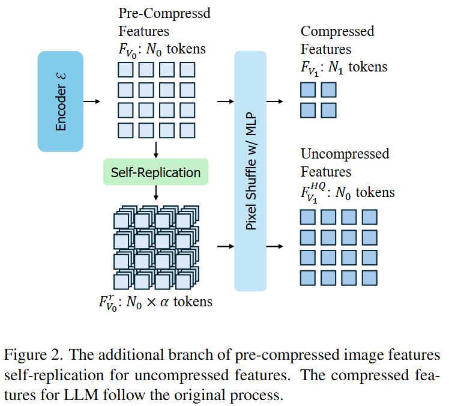
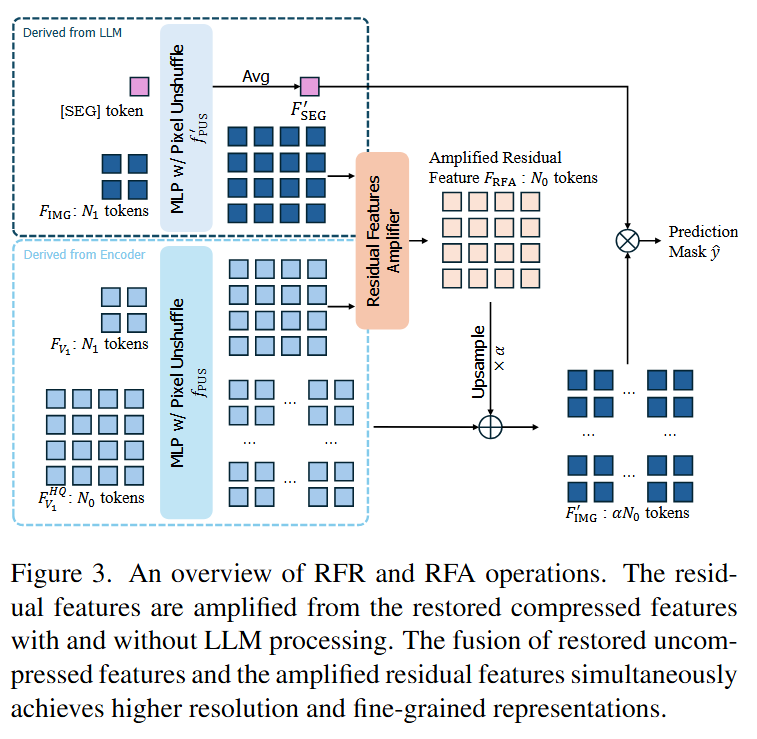
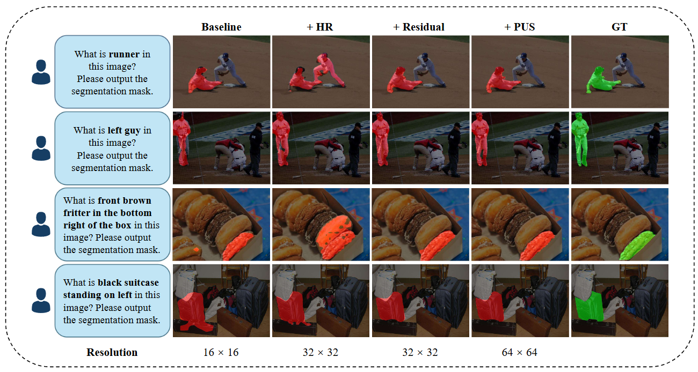
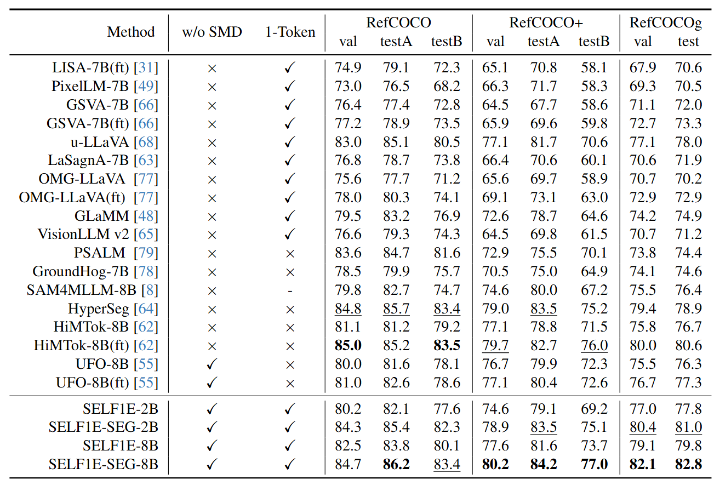
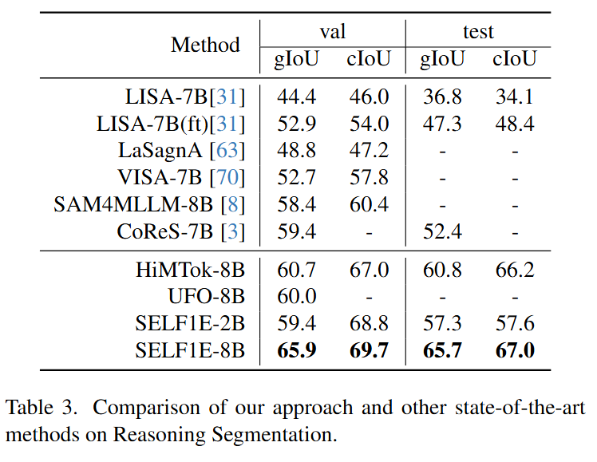

# SELF1E: Rethinking MLLM Itself as a Segmenter with a Single Segmentation Token

<div align="center">

[Anqi Zhang](https://scholar.google.com/citations?user=DmRZv5sAAAAJ)<sup>1,2</sup>, &nbsp; 
Xiaokang Ji<sup>1</sup>, &nbsp;
[Guangyu Gao](https://scholar.google.com/citations?user=snmRfqMAAAAJ)<sup>1*</sup>, &nbsp;
[Jianbo Jiao](https://mix.jianbojiao.com/)<sup>2</sup>, &nbsp;
[Chi Harold Liu](https://scholar.google.com/citations?user=3IgFTEkAAAAJ)<sup>1</sup>, &nbsp;
[Yunchao Wei](https://weiyc.github.io/)<sup>3,4</sup>

<sup>1</sup>School of Computer Science, Beijing Institute of Technology<br>
<sup>2</sup>The MIx group, School of Computer Science, University of Birmingham<br>
<sup>3</sup>WEI Lab, Institute of Information Science, Beijing Jiaotong University<br>
<sup>4</sup>Beijing Academy of Artificial Intelligence<br>
</div>

<p align="center">
  <a href="https://huggingface.co/UltraDoughnut/SELF1E">
    
  </a>
  <br>
Paper is accepted by CVPR 2026.
</p>

## Highlights

✅️ No external expert decoder for text-guided referring segmentation. 

✅️ Only 1 ```[SEG]``` token for segmentation. 

✅️ First method integrating two characteristics above with solid and competitive performance. 

🚀 Step forward for integrating segmentation ability inside MLLM. 

## Abstract

Our project aims to investigate whether and how we can unlock segmentation ability from MLLM it**SELF** with **1** segmentation **E**mbedding (**SELF1E**) while achieving competitive results, which eliminates the need for external decoders.
To this end, our approach targets the fundamental limitation of resolution reduction in pixel-shuffled image features from MLLMs.

- First, we retain image features at their original uncompressed resolution, and refill them with residual features extracted from MLLM-processed compressed features, thereby improving feature precision. 
- Subsequently, we integrate pixel-unshuffle operations on image features with and without LLM processing, respectively, to unleash the details of compressed features and amplify the residual features under uncompressed resolution, which further enhances the resolution of refilled features. 
- Moreover, we redesign the attention mask with dual perception pathways, i.e., image-to-image and image-to-segmentation, enabling rich feature interaction between pixels and the segmentation token.

<p align="center">
  
  
</p>

## Visualization

<p align="center">
  
</p>

## Performance

<p align="center">
  
  
</p>

## Installation
```
pip install -r requirements.txt
```
Note: Qwen2 models in some of the versions of transformers may not have ```attention_mask``` argument, you may have to modify the code. 

## Dataset Preparation

### Segmentation Data Preparation
Following the [LISA](https://github.com/JIA-Lab-research/LISA) dataset preparation, the training data consists of 4 types of data:

1. Semantic segmentation datasets: [ADE20K](http://data.csail.mit.edu/places/ADEchallenge/ADEChallengeData2016.zip), [COCO-Stuff](http://calvin.inf.ed.ac.uk/wp-content/uploads/data/cocostuffdataset/stuffthingmaps_trainval2017.zip), [PACO-LVIS](https://github.com/facebookresearch/paco/tree/main#dataset-setup), [PASCAL-Part](https://github.com/facebookresearch/VLPart/tree/main/datasets#pascal-part), [COCO Images](http://images.cocodataset.org/zips/train2017.zip)

    Note: For COCO-Stuff, we use the annotation file stuffthingmaps_trainval2017.zip. We only use the PACO-LVIS part in PACO. COCO Images should be put into the `dataset/coco/` directory.

2. Referring segmentation datasets: [refCOCO](https://web.archive.org/web/20220413011718/https://bvisionweb1.cs.unc.edu/licheng/referit/data/refcoco.zip), [refCOCO+](https://web.archive.org/web/20220413011656/https://bvisionweb1.cs.unc.edu/licheng/referit/data/refcoco+.zip), [refCOCOg](https://web.archive.org/web/20220413012904/https://bvisionweb1.cs.unc.edu/licheng/referit/data/refcocog.zip), [refCLEF](https://web.archive.org/web/20220413011817/https://bvisionweb1.cs.unc.edu/licheng/referit/data/refclef.zip) ([saiapr_tc-12](https://web.archive.org/web/20220515000000/http://bvisionweb1.cs.unc.edu/licheng/referit/data/images/saiapr_tc-12.zip)), [gRefCOCO](https://github.com/henghuiding/gRefCOCO)

    Note: the original links of refCOCO series data are down, and we update them with new ones. If the download speed is super slow or unstable, we also provide a [OneDrive link](https://mycuhk-my.sharepoint.com/:f:/g/personal/1155154502_link_cuhk_edu_hk/Em5yELVBvfREodKC94nOFLoBLro_LPxsOxNV44PHRWgLcA?e=zQPjsc) to download. **You must also follow the rules that the original datasets require.**

3. Reasoning segmentation dataset: [ReasonSeg](https://drive.google.com/drive/folders/125mewyg5Ao6tZ3ZdJ-1-E3n04LGVELqy?usp=sharing)

### VQA data preparation

1. Advanced Visual Question Answering dataset: [LLaVA-Instruct-150k](https://huggingface.co/datasets/liuhaotian/LLaVA-Instruct-150K/blob/main/llava_instruct_150k.json)

2. Traditional Visual Question Answering dataset: Follow [InternVL VQA datasets](https://github.com/OpenGVLab/InternVL/blob/main/internvl_chat/eval/vqa/README.md) for preparation. We use vqav2, okvqa, textvqa, vizwiz, gqa datasets for training. 

### Dataset Organization

Download them from the above links, and organize them as follows.

```
├── dataset
│   ├── ade20k
│   │   ├── annotations
│   │   └── images
│   ├── coco
│   │   └── train2017
│   │       ├── 000000000009.jpg
│   │       └── ...
│   ├── cocostuff
│   │   └── train2017
│   │       ├── 000000000009.png
│   │       └── ...
│   ├── llava_dataset
│   │   └── llava_instruct_150k.json
│   ├── reason_seg
│   │   └── ReasonSeg
│   │       ├── train
│   │       ├── val
│   │       └── explanatory
│   ├── refer_seg
│   │   ├── images
│   │   │   ├── saiapr_tc-12 
│   │   │   └── mscoco
│   │   │       └── images
│   │   │           └── train2014
│   │   ├── refclef
│   │   ├── refcoco
│   │   ├── refcoco+
│   │   ├── refcocog
│   │   └── grefcoco
│   └── vlpart
│       ├── paco
│       │   └── annotations
│       └── pascal_part
│           ├── train.json
│           └── VOCdevkit
├── data
│   ├── coco
│   ├── gqa
│   ├── mmbench
│   ├── mme
│   ├── okvqa
│   ├── pope
│   ├── textvqa
│   ├── vizwiz
│   └── vqav2
```

## Training and Evaluation

Training model with 1 epoch:
```
deepspeed --master_port=24995 train_hf_ivl_seq.py \
    --version="***/InternVL3-2B" \
    --dataset_dir='./dataset' \
    --dataset="sem_seg||refer_seg||reason_seg||vqa" \
    --sample_rates="1,1,1,1" \
    --batch_size 5 \
    --grad_accumulation_steps 8 \
    --gradient_checkpointing \
    --exp_name="${EXP_NAME}" \
    --model_max_length 512 \
    --explanatory -1 \
    --lora_r 128 \
    --lora_alpha 256 \
    --epochs 1 \
    --lr 1e-4 \
    --vision_lr 1e-4 \
    --optimize_vision \
    --use_llm_lora \
    --use_vision_lora 
```

Training model with more segmentation data for **SEG** version:

```
deepspeed --master_port=24995 train_hf_ivl_seq.py \
    --version="***/InternVL3-2B" \
    --dataset_dir='./dataset' \
    --dataset="sem_seg||refer_seg||reason_seg||vqa" \
    --sample_rates="6,20,6,1" \
    --batch_size 5 \
    --grad_accumulation_steps 8 \
    --gradient_checkpointing \
    --exp_name="${EXP_NAME}" \
    --model_max_length 512 \
    --explanatory -1 \
    --lora_r 128 \
    --lora_alpha 256 \
    --epochs 1 \
    --lr 1e-4 \
    --vision_lr 1e-4 \
    --optimize_vision \
    --use_llm_lora \
    --use_vision_lora 
```

Evaluate on all segmentation datasets:
```
bash eval_all.sh
```

Evaluate on VQA datasets: Please refer to [InternVL VQA datasets](https://github.com/OpenGVLab/InternVL/blob/main/internvl_chat/eval/vqa/README.md) for preparation and download the codes, and then run:
```
bash eval_vqas.sh
```

Note: DeepSpeed ZoRO-3 optimization is not supported for this method due to the customized design of MLLM and dataloading. 

## Citation 
If you find this project useful in your research, please consider citing:

```

```

## Acknowledgement
-  This work is built upon the [LISA](https://github.com/JIA-Lab-research/LISA) and some of the training settings are borrowed from [PSALM](https://github.com/zamling/PSALM). Thanks for their extraordinary works. 
